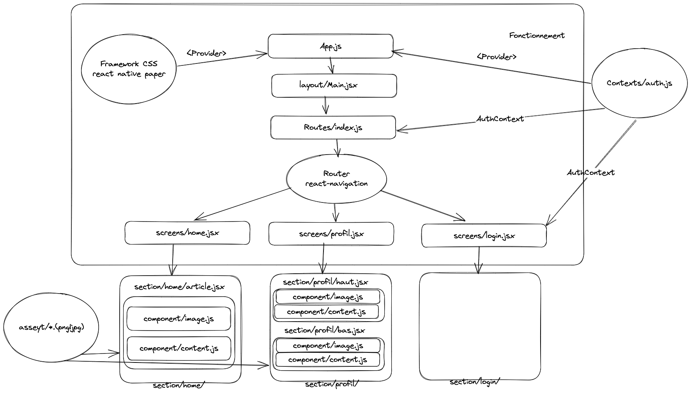

## Prerequisites

1. Check expo.dev is installed
2. Check npm or yarn & nodejs are installed

## Getting started

1. Clone this project
2. Run `npm install` from the root folder
3. Run `npm start` from the root folder

## Built With

- [Expo](https://expo.dev)
- [React Native](https://reactnative.dev)
- [React Navigation](https://reactnavigation.org)
- [React Native Paper](https://callstack.github.io/react-native-paper/)
- [Expo vector icons](https://www.npmjs.com/package/@expo/vector-icons) - [Ressources Expo icons](https://icons.expo.fyi/)

## Tutos

- [Camera](https://www.freecodecamp.org/news/how-to-create-a-camera-app-with-expo-and-react-native/)

## UML

